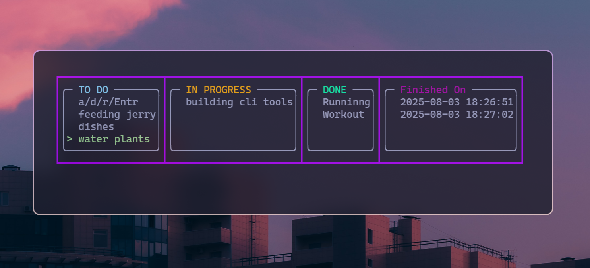

#  dodone — Terminal Task Tracker

`dodone` is a minimalist, terminal-based task tracking tool built for speed, clarity, and control.  
Navigate with arrow keys. Move tasks instantly. Get things done without distractions.

---

##  Preview



---

##  Demo Video


---

##  Features

- Three task states: **To-Do**, **In Progress**, **Done**
- Keyboard-driven UI (Arrow keys, `Enter`, `a`, `d`, `r`, etc.)
- Visual layout with Unicode box-drawing characters
- JSON auto-save on every change (no need to press save)
- Simple CLI startup: just type `dodone`

---

##  Installation (Linux/macOS)

```bash
git clone https://github.com/yourusername/dodone.git
cd dodone
./install.sh
```
##  Installation (windows)

```bash
git clone https://github.com/yourusername/dodone.git
cd dodone
mkdir build
cd build
cmake .. -G "MinGW Makefiles"
mingw32-make
```
- Go to the build folder and search for dodone.exe and copy it to any folder in your C: drive (you can even create a new folder if you want) and add that folder to Environment Variables of your system.
---
## Tips
- You can skip the `demo/` folder — it only contains screenshots and a GIF for showcasing the tool. It is not required for running the CLI.
- Found a bug or want to contribute? Feel free to open a pull request or reach out on [Twitter](https://x.com/_crack_head_).

